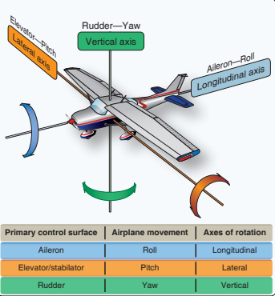

--8<-- "includes/abbreviations.md"

[Adapted from FAA-H-8083-3B Chapter 3](https://www.faa.gov/regulations_policies/handbooks_manuals/aviation/airplane_handbook/media/05_afh_ch3.pdf){target=new}

## Introduction

Airplanes operate in a different environment than a car, bike or just by walking. Drivers and bikers tend to focus on the forward motion and new pilots tend to do the same. However, an airplane operates in a 3-dimentional 3D environment. Pilots need to be aware of horizontal, vertical, and lateral movement. The four fundamentals are the principle maneuvers that control an airplane during flight.

!!! note "The Four Fundamentals"
    The four fundamentals of flight are: straight-and-level flight, turns, climbs, and descents.

## Importance of The Four Fundamentals

To master any subject, you need to master the fundamentals first. Attempting to conduct advanced maneuvers before mastering the fundamentals, hinders the learning process. To be a competent pilot, you need to first master the basic fundamentals of airmanship.

!!! quote
    Consider the following: a takeoff is a combination of straight-and-level flight and a climb; turning on course to the first navigation fix after departure is a climb and a turn; and the landing at the destination is a combination of airplane ground handling, acceleration, pitch and a climb. 

As you progress to more difficult flight maneuvers, any deficiency in the mastery of the four fundamentals are likely to become barriers in your learning. Many new pilots notice difficulty in advanced maneuvers if they have a lack of understanding, training, or practice of the four fundaments. So, lets change that!

## Flight Controls

An airplane flies in a 3D environment, meaning, it can travel up, down, left, right, forwards, and backwards.

The forward movement of the elevator control will always move the plane in the same direction relative to the pilot's perspective. If the plane is right side up relative to the horrizon, pushing forward on the elevator control will cause the plane to descend. On the other hand, if the plane is upside down relevant to the horrizon, the same action will cause the plane to climb. Depending on the airplane's orientation to the earth, the same control actions can result in different reactions. That's why we came up will the following rule:

!!! info
    The pilot is always considered the referenced center of effect as the flight controls are used.

{ align=left width="350"}

The following is always true regardless of the orientation to earth:

*With the pilot's hands:*

- Pulling the elevator pitch control toward the pilot (otherwise called back pressure) will cause the airplane's nose to rotate backwards around the pitch (lateral) axis of the airplane.
- Pushing the evelator pitch control away from the pilot (otherwise called forward pressure) will cause the airplane's nose to rotate forwards around the pitch axis of the airplane.
- Rotating the aileron control to the **right** will cause the airplane's **right** wing to bank (roll) lower.
- Rotating the aileron control to the **left** will cause the airplane's **left** wing to bank lower.

*With the pilots' feet:*

- Pushing the **right** rudder pedal away from the pilot (forward pressure) will cause the airplane's nose to move (yaw) to the **right**.
- Pushing the **left** rudder pedal away from the pilot (forward pressure) will cause the airplane's nose to yaw to the **left**.

<!-- Feel of the Airplane -->